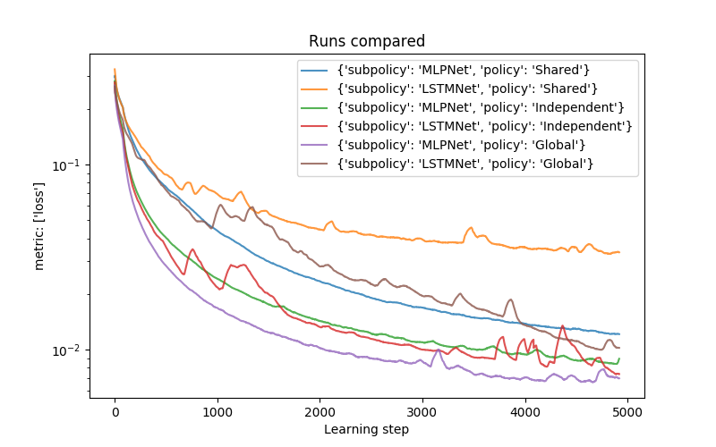
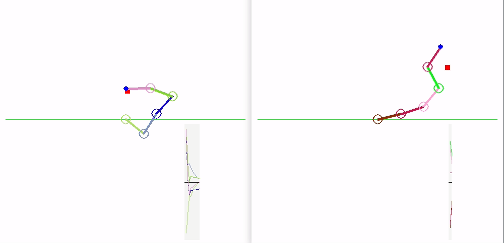
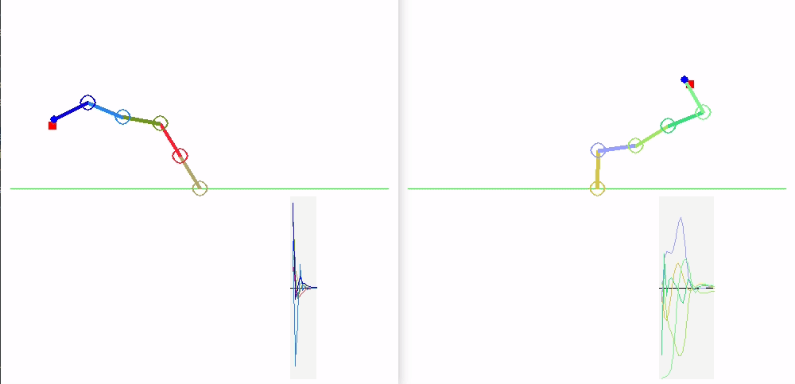
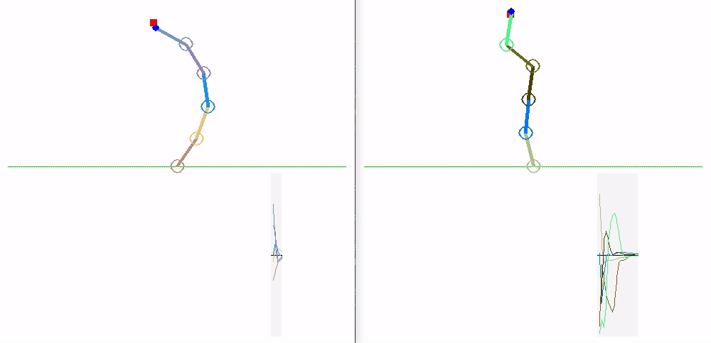
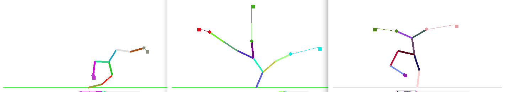
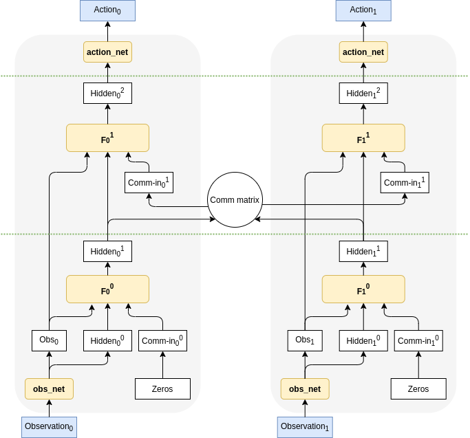
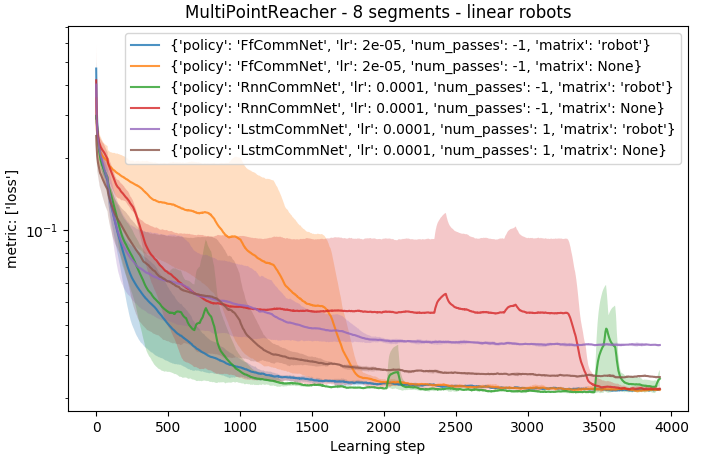
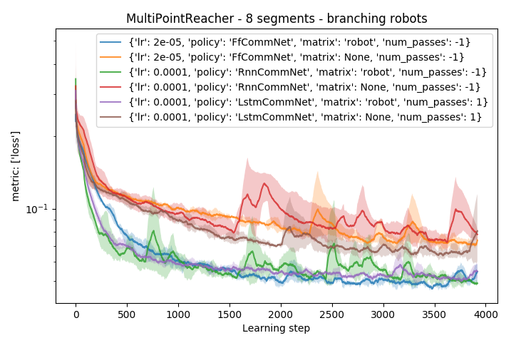
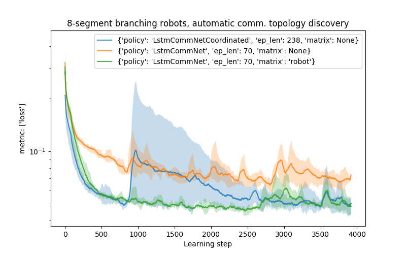

# Benefits of modular approach - generalization

Usually, in Deep Learning, the tasks are solved by a big monolithic Artificial Neural Network.
 
Compared to this, one of the properties of [the Badger architecture](https://arxiv.org/pdf/1912.01513.pdf) is modularity:
 instead of using one big neural network, the Badger should be composed of many small Experts which solve the whole task in a collaborative manner. 
 Further assumption is that these Experts share the weights, therefore are identical at the beginning. 
 
Despite the fact that this approach introduces several complications, it has many benefits as well. 

Several [benefits of modularity](https://www.goodai.com/wp-content/uploads/2020/06/Topic-1-When-is-modularity-collectivity-multi-agentness-beneficial.pdf) include:

* System is able to dynamically change its size based on the task, therefore Badger should be able to solve tasks normal ANNs are not able to solve.
* Scaling with number of Experts: we should be able to train on small scale of problem (e.g. small num. Experts) and then deploy to big scale.
* Modular policies should generalize better (e.g. [[Goyal et al, 2020](https://arxiv.org/abs/1909.10893)], [[Greff et al, 2017](https://arxiv.org/abs/1708.03498)]).

This article uses simple experiments to illustrates the following topics:

1. Ability to train on small version of the task and then being able to deploy to modified versions of the tasks without changing the Expert policy (weights). Policies trained on small robots generalize to robots of different size and/or shape.
2. In more complicated case, the tasks usually requires the Experts to communicate with each other. One of open questions is how an efficient communication topology should look like and if it is possible to establish it automatically from data.

# Experiment 1 - Experts without communication
## Experiment description

Similarly to these papers [[Huang et al, 2020](https://arxiv.org/abs/2007.04976)], [[Medved et al. 2020](http://medvet.inginf.units.it/publications/evolutionofdistributedneuralcontrollersforvoxelbasedsoftrobots)] a modular policy is used to control robots. 
We have simple manipulator robots, where each segment is controlled by one simple Expert. 
These Experts share weights (and are implemented using either a MLP or LSTM network). 

Here, the task is to reach the target position marked by the red square. 

Our custom simulator is fully differentiable and therefore the policies can be trained quickly in a supervised setting.

In case the robot has 5 segments there is 5 Experts. Each Expert is observing own segment of the robot (position in 2D space)
 together with the common goal and is able to control it (applies force to the rotation of the joint).

Together, these Experts should collaboratively achieve the common goal, in this case: reach the goal position with end of the robot.

## Policy parametrizations

We compare modular approach with several baselines. The following versions were compared:

* Global: LSTM/MLP - in this case, one monolithic network sees and controls the whole robot,
* Independent: LSTM/MLP - here, each robot segment is controlled by one Expert, but these Experts do not share weights,
* Shared: LSTM/MLP - the same as Independent, but the Experts share weights.

## Training

The following graph shows learning curves of shared modular policies compared with baselines. The loss is a mean distance of the effector to the goal during the episode (rollout). The following lines are averaged from 5 runs. 

We can see that both shared policies (MLP and LSTM) tend to converge to worse performance than other versions.
This is caused by the fact that there is no communication (the Experts have to coordinate implicitly) and the Experts 'do not know' exactly in which part of the robot they are.

## Trained policies

Here we can see how the trained policies perform.

Global: MLP (left) and LSTM (right):

Independent: MLP (left) and LSTM (right):

Shared: MLP (left) and LSTM (right):

## Zero-shot generalization to different robots

But the main benefit of this approach is that it should be able to generalize to different robot sizes. 

The Global version cannot do this (since it would change sizes of inputs/outputs of the ANN),
while in case of Independent policies we can add Experts, but we don't know how to chose their weights.
 
Since the Shared policy has the same weights everywhere, we can easily reshape the robot without retraining the Experts.

The following animations show how the Expert policy trained on robot with 5 segments generalizes to different robot sizes.

Shared: LSTM:

Shared: MLP:

<!---
-->

# Experiment 2 - Different communication topologies

The goal of this experiment is to show influence of different communication topologies on the performance of the model and its ability to generalize outside the training distribution.

Therefore tasks in this experiment require communication.
 
Compared to the previous experiment:

* Each robot topology is randomly generated (probability of branching is either 0 or 0.5),
* Each effector of the robot has own goal (shown as a square connected by a thin line to the effector),
* Only effectors perceive their goals.

This task requires the Experts (robot segments) to communicate with each other: the effectors have to share own goal to the non-effector segments in order to collaborate on reaching the goal.

# Policy parametrization

A basic CommNet model [[Sukhbaatar et al 2016]](https://arxiv.org/abs/1605.07736) (where the messages from communication channel are aggregated by averaging) was used. 
Here, all parameters between Experts are shared and the model does `num_passes` of communication steps between the environment steps. 

The following image depicts the CommNet with two modules/Experts with `num_passes=1`. The part between green dashed lines is repeated `num_passes` times before computing the actions.

The following versions were tested:

* FfCommNet: each `f^i` network is parametrized by a separate MLP network,
* RnnCommNet: weights of `f^i` are shared for all `num_passes` of communication (effectively implementing a RNN),
* LstmCommNet: LSTM is used as a `f^i`, `hidden^i` is composed of hidden and cell LSTM state and these are not re-initialized from the observation between environment steps.

In the graphs below, `num_passes=-1` means that the `num_passes==num_segments==8`, while `num_passes=1` means that there is one communication step per environment step.

All these models are compared on the two following versions of communication `matrix`:

* Matrix=None: means that the messages are aggregated from all other Experts
* Matrix=robot: means that messages can be exchanged only between neighbouring segments (similarly to [[Wang et al, 2018]](http://www.cs.toronto.edu/~tingwuwang/nervenet.html)). The messages are passed from the effectors towards the robot root (base).

## Training

The following graph shows convergence of the models on the robots with 8 segments without branching (each line is average from 3 runs).

Linear robots imply only one goal per robot, therefore a structure in the communication is not important (since the whole robot has the same goal).

The only notable difference in performance is in the case of `LstmCommNet`, which uses `num_passes=1`. In this case, it takes more steps to message to propagate through the robot, leading to worse average distance to goal.
It is also noticeable that `RnnCommNet` converges less reliably, which is probably caused by the shared weights between communication steps. 

The following graph shows comparison on branching robots. Here, the communication based on the topology of the robot clearly helps to achieve higher performance compared to the fully connected communication.

The constraints given by the topology help to isolate goals produced by different effectors.

## Benefits of structured/local communication

In case of communication in the modular systems, one of the most interesting questions is how the communication should be structured.

In the case of branching robots (multiple different goals of the agent), it be seen that **constraining the communication** by the robot skeleton *helps separating concerns* about these goals and therefore helps particular segments to specialize in their behavior.

Since the communication is **local**, it leads to **better scalability** of the whole agent.

The following animation shows performance of the policy trained on 8-segment robots, tested on 30-segment robots.
 
The policy which uses skeleton for communication still performs reasonably well, since different part of the topology can focus on different goals.

**Left**: the fully connected topology, **right**: the skeleton-constrained one:

<!---

-->

The following animation shows the response of the policy to change of goal positions of one of the goals. It can be visible that fully connected one (**left**) performs worse and is not able to manipulate specific parts of the robot separately.
While in the skeleton-based communication (**right**) parts of the robot respond much more independently.

# Experiment 3 - Automatically discovered communication topologies

The experiment is work in progress, but illustrates a potential direction of further research.

The previous experiment shown that the communication topology matters (but is task specific).
Now the question is: is there a way to discover an efficient communication topology automatically?

## Proposed topology discovery mechanism

Here, the idea is based on the assumption that it is that the `target_expert` needs to receive messages from other Experts whose observations it influences. 
From these Experts it should receive messages, which contain requests what it should do.  

In case of this task, the `target_expert` should receive messages from other Experts whose spatial positions it influences.
There is a pre-task coordination phase which goal is to determine the communication matrix, which would be suitable for a given robot.

### Coordination heuristic algorithm

The proposed algorithm has a form of fixed heuristic algorithm and is based on the assumption above. 
During the pre-task coordination phase, only one `target_expert` outputs random actions at a time (others output zeros).
As a result, the `comm_matrix` corresponding to its inputs contains an average magnitude of change between consecutive observations of other `source_expert`s. 
Therefore each Expert receives only messages from expert it influences.

This way, a robot-specific `comm_matrix` is automatically discovered before the episode and used for the communication during solving the task.

### Training

The following graph shows comparison of training with the heuristic coordination algorithm on branching robots (since in case of linear robots, the difference is not significant).

<!---
This configuration works on linear robots, but it's performance is inferior to both fully connected and topology-following communication schemes in case of branching robots.
-->

We can see that the performance on the task with automatically discovered communication structure (`LstmNetCoordinated`) is better than fully connected one (`matrix=None`) and achieves comparable performance as the skeleton-based communication (`matrix=robot`). 

Naturally, this heuristic algorithm discovers communication topologies that are different than the skeleton-based ones (see below). In the automatically discovered case, each Expert receives messages from all other Experts it influences in one communication step (which might be more efficient but might cause more message mixing), while in the skeleton-based case, the message delivery can take multiple environment steps, but there is always only `num_children` messages averaged together.

This is an illustration of automatic discovery of the communication topology. During the pre-task coordination phase, only one segment moves at a time, the heuristic algorithm records how the actions influence observations of other Experts, this is recorded into the comm. matrix. 
Finally, the comm. matrix entries are thresholded to 0/1 values and task inference starts. In the 8x8 comm. matrix (shown left bottom in the animation) each row corresponds to the message recipient, and each column to senders. For example: a value 1 (green) in [row 1, column 2] means that Expert 1 receives message from Expert 2.

## Future work

<!---
This task is solvable without communication between Experts.
Natural future extension to make the task partially observable from the point of an Expert, to employ the communication 
between them and to aim for bigger out-of-distribution zero-shot task generalization.
-->

Our goal could be described as a modular meta-learning architecture. These experiments are a small stepping stone towards that. 
The aim here is to show several benefits of modular approach to learning and problem solving, compared to a monolithic one. 

In the modular approach, there are several open questions (e.g. how to split observation spaces amongst individual Experts, or how to merge actions proposed by them). 
These tasks were designed in a way that the problem of splitting/merging is solved trivially and we can focus on other questions,
 as e.g. an efficient and general communication between Experts. 
 
Later, one of the future goals is to address this question of division of data between Experts, where the experiments will shift from "agents in the environment" more towards "Experts in the brain of one agent". An inspiration to this can be seen e.g. in [[Locatello et al, 2020](https://arxiv.org/abs/2006.15055)].

